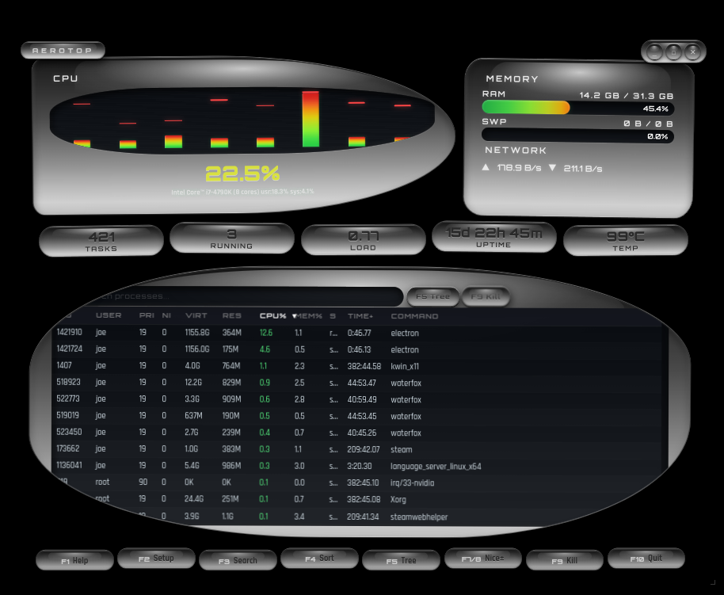

# 🌊 Aerotop

**Aerotop** is a high-performance system monitor for Linux, wrapped in a surreal, bioluminescent "Frutiger Aero" aesthetic. It combines glassmorphism and glossy gels with modern system telemetry.



## ✨ Features

- **True Frutiger Aero Aesthetics**: Glossy gradients, sharp specular highlights, and organic "blob" containers.
- **Deep System Telemetry**: Monitored via the robust `systeminformation` engine.
- **htop-Style Process Table**: Comprehensive 11-column view including PRI, NI, VIRT, RES, TIME+, and full command paths.
- **Interactive EQ Visualizer**: Bioluminescent per-core CPU load bars with persistent peak markers.
- **Advanced Navigation**:
  - **F5 Tree View**: Hierarchical parent-child process visualization with Unicode branch support.
  - **F1 Help & About**: Beautiful frosted-glass overlays for shortcuts and credits.
  - **F4 Sort Cycling**: Quickly rotate through CPU, Memory, PID, User, and more.
  - **F9 Kill Dialog**: Signal-based process management with a dedicated GUI.
- **Customization (F2 Setup)**: Tweak visual history and gradient smoothing via integrated gel-toggles.

## ⌨ Keyboard Shortcuts

| Key | Action |
| --- | --- |
| **F1** | Toggle Help Overlay |
| **F2** | Toggle System Setup |
| **F3 / /** | Focus Search |
| **F4** | Cycle Sort Column |
| **F5** | Toggle Tree View |
| **F7 / F8** | Nice - / Nice + (on selected process) |
| **F9** | Kill Dialog / Send Signal |
| **F10** | Quit App |
| **Esc** | Close Overlays / Clear Search |

## 📦 Downloads & Installation

### 📥 Standalone Binaries
You can download pre-built binaries for your platform from the [Releases](https://github.com/joe-george-1/aerotop/releases) page:
- **Windows**: `Aerotop-Setup-1.0.0.exe` (NSIS Installer)
- **Linux**: `Aerotop-1.0.0.AppImage` (Universal)
- **macOS**: `Aerotop-1.0.0.dmg` (Intel/Apple Silicon)

### 🐧 Linux Repositories

#### Arch Linux (AUR)
Aerotop is available in the AUR. You can install it using an AUR helper like `paru` or `yay`:
```bash
yay -S aerotop
```
*(Note: If not yet in the official AUR, see the `PKGBUILD` in the root of this repo to build manually.)*

#### KDE Discover / GNOME Software (Flatpak)
We are currently working on a Flathub submission. In the meantime, you can build the AppImage or use the standalone binary.

## 🛠 Development & Building from Source

If you want to build Aerotop yourself or contribute to the project:

### Prerequisites:
- [Node.js](https://nodejs.org/) (v16+)
- npm

### Setup:
```bash
# Clone the repository
git clone https://github.com/joe-george-1/aerotop.git
cd aerotop

# Install dependencies
npm install
```

### Build Commands:
```bash
# Run in development mode
npm run dev

# Build for your current platform
npm run build:linux   # AppImage
npm run build:win     # Windows NSIS
npm run build:mac     # macOS DMG
```

## 🛠 Tech Stack

- **Framework**: Electron (v1/Release)
- **Telemetry**: `systeminformation`
- **UI**: Vanilla HTML5, Evergreen CSS3, Modern JavaScript

---

### 🔮 Future Roadmap (The Tauri Migration)

While **Electron** has allowed us to achieve this level of visual polish and system access quickly, we recognize the desire for a "low-impact" monitor. 

**Version 2.0** is planned to migrate to **Tauri**. This will significantly reduce the memory footprint (from ~200MB to ~20MB) by leveraging the OS's native webview and Rust-based system bindings. 

---

**Made by Joe George with Claude Opus 4.6 — February 2026**
